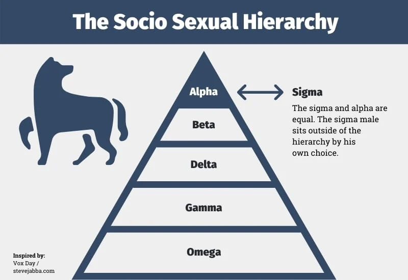
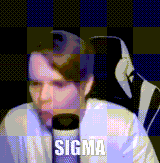

# 😔😔 Эссе - не приговор 😔😔

---

<br>

Случай с кошкой, вызвавший катастрофу катастрофических масштабов на моей клавитуре
вынуждает меня извиниться перед вами. Возможно этот небольшой инцидент принесёт в наш мир 
капельку хаоса и немного художественного колорита, по моему мнению данный случай достоин
называться **художественным произведением**

Однако я бы хотел перейти к более философским аспектам жизни программиста. Моя функция `sigma` сопровождаемая загадочным
вопросом `Вы сигма? Подумайте об этом...` является попыткой обратить внимание на более
глубокие аспекты программирования, чем просто написание кода.

Все мы, как настоящие прирождённые программисты, часто оказываемся в повседневной рутине и апатии,
данное состояние может быть вызвано сильным переутомлением, ведь изо дня в день, видя очередные строки кода
со временем начинают нам казаться лишь суммой из вечно повторяющихся элементов. 
Однако, в этой фразе скрыта не только математическая ассоциация. `Вы сигма?` звучит как загадочный вопрос,
приглашение к самопроекции. Я призываю задуматься о том, как мы `"суммируем"` свои знания, опыт и творческий потенциал в мире
программирования ```╰(*°▽°*)╯```


# Перед тем как продолжить, я бы хотел для начала уяснить понятие слова `сигма`

### Что значит быть Сигмой?

</center>

<br>

#### Понятие `«сигма-самец»` — сленговый термин, появившийся из расширенной ненаучной теории о социальной иерархии, где с помощью букв греческого алфавита обозначают положение мужчиныв обществе.


<br>
<hr>


#### Также `сигма` может означать мимику лица, поступки человека или же его мировоззрение





<br>
<hr>

Однако, `сигма` - это не только математическое понятие или ассоциация.
`Сигма` - это также состояние души, олицетворение музыки в мире программирования. 
Виртуозные ноты и гармония в коде могут создавать нечто большее, чем просто программу.
Они могут трансформировать абстрактные строки в арт, вибрирующий настрой и эмоции.😒

Позвольте мне поделиться фрагментом аудио, который вдохновлен __`сигмой`__ программирования.
Звуки кода, как ноты, объединяются, создавая мелодию цифрового творчества. 
Давайте насладимся этим моментом вместе. 🎵

https://drive.google.com/file/d/1vo9dS-xQJyesjLs2HzWqaFuW3cx4YKT6/view?usp=sharing


<hr>
<br>


## Вернёмся к вопросу 

Этот вопрос становится нечто большим, чем просто строкой в коде в коде. Он становится
`"филосовской проблемой"`, приглашением к размышлению о собственной роли в этом киберпространстве.
Каким образом мы влияем на код? Каким образом он влияет на нас? Мы лишь `"капля"` в море бескрайнего 
кода, и всё же, каждая строка несёт в себе потенциал для творчества, для изменения
и для отражения наших собственнных мыслей и идей.

Таким образом `"Вы сигма? Подумайте об этом..."` становиться не только вызовом к самопроекции, но и возможностью
обнаружить философскую глубину в мире нулей и единиц. Как программисты, мы не просто создаём код, мы создаём
`"историю"`, мысль и, возможно, частичку смысла в этом мире алгоритмов и инструкций


<br>
<hr>


# С уважинем `[Klim team]`

